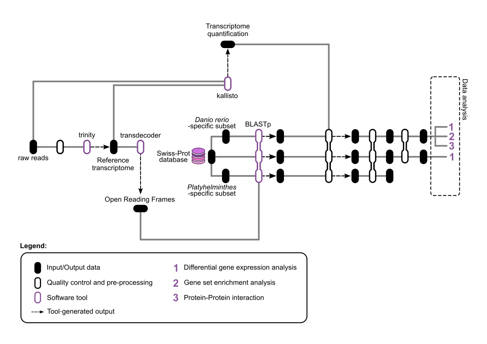

# Functional RNA-seq analysis of *Pomatoschistus microps*

Bioinformatics analysis of RNA-seq data from *Pomatoschistus microps* sampled across three coastal locations in Portugal and two seasons, exploring molecular responses to thermal stress in a non-model organism.

The analysis includes **18 liver RNA-seq samples** collected across:

- **3 locations:** Troia, Ria Formosa, and Ria de Aveiro
- **2 seasons:** Spring and Summer

> [!NOTE]
> 
> Non-model organisms — organisms of substantial ecological or evolutionary importance but with limited prior characterization — often have limited functional annotation. Because *P. microps* is a non-model organism, the workflow compares and integrates BLASTp results from three reference datasets to improve functional interpretation.

## Pipeline

Integrated	transcript	abundance	data	(Kallisto)	with	functional	annotations	from	TransDecoder	and	BLASTp against	UniProtKB/Swiss-Prot,	adapting	workflows	across	three	reference	databases.

Differential	expression	analysis	with	edgeR,	functional	enrichment	with	multiGSEA	(KEGG),	and	protein–protein interaction	networks	with	STRING.

## Key outputs

✓ Integrated functional annotation

✓ Differentially expressed genes

✓ KEGG pathway enrichment

✓ Protein–protein interaction networks

This work was developed as part of the **ExtremeOceans project (UCIBIO · CESAM · CCMAR)**.
